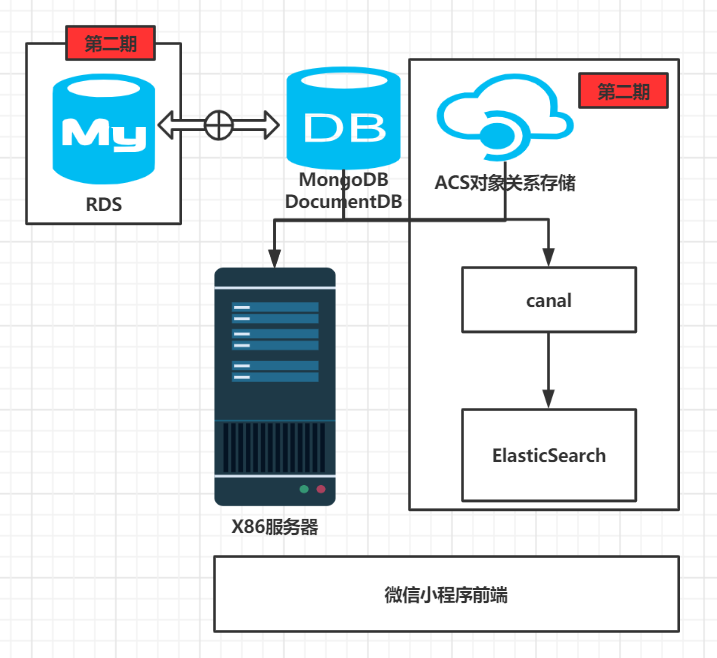

# ZRFintech
投融小管家项目组详细设计文档
### 系统架构

### 主要对象实体

### 功能点列表
#### 用户登陆
#### 投资人信息展示（企业视角）
#### 项目展示（投资人视角）
#### 查询最新项目草稿
#### 项目上传
#### 项目补充信息
#### 已上传项目查询
#### 上传项目删除
#### bp下载 
#### 红包模块
#### 评论模块
#### 投资人评论资费总金额页面


### 系统架构
    系统架构如下图所示，为了保证前期MVP开发，后端所有云资源均采取最简化配置（单机），由于数据关系相对简单
    且不存在较多关联查询，为快速部署和易于拓展，项目初期采用非关系型数据库。前期由于不存在搜索功能，所以canal和ES的
    资源也暂时不部署。对于图片、BP书由于前期数量不大，暂且均存在后端服务器上，后续搬上ACS对象存储服务器。
    后续业务流程复杂以后，考虑引入RDS如Mysql。


### 主要对象实体
#### 投资人基础信息

初始化导入

|字段名称|字段释译|字段类型|备注|
|:----:|:----:|:---:|:---:|
|investorId|投资人Id|String|拟采用自增id|
|orgNm|机构名称|String||
|phoneNm|手机号码|String|白名单初始化|
|investor|投资人姓名|String||
|introd|投资人介绍|String||
|invesEmail|投资人邮箱|String||
|invesPhotoRoute|投资人照片路径|String||
|invesOrgPhotoRoute|投资人机构照片路径|String||
|photo|投资人头像数据|String|仅在返回时作为字段使用|
|orgPhoto|机构图片数据|String|仅在返回时作为字段使用|
|price|评论资费原价|BigDecimal||
|disCountPrice|评论资费折扣价|BigDecimal||
|unaccomplishedAmount|投资人未获取的资费金额|BigDecimal||
|accomplishedAmount|投资人已获取的资费金额|BigDecimal||
|indusLab1|行业标签1|String||
|indusLab2|行业标签2|String||
|indusLab3|行业标签3|String||
|indusLab4|行业标签4|String||
|indusLab5|行业标签5|String||
|indusLab6|行业标签6|String||

#### 用户基础信息
|字段名称|字段释译|字段类型|备注|
|:----:|:----:|:---:|:---:|
|openId|用户唯一识别号|String||
|phoneNm|手机号|String||
|nickName|微信名称|String||
|gender|性别|char||
|city|城市|String||
|province|省|String||
|country|国|String||

#### 项目基础信息
|字段名称|字段释译|字段类型|备注|
|:----:|:----:|:---:|:---:|
|projectNo|项目编号|String|项目唯一识别编号|
|projectNm|项目名称|String||
|proIndus|所属行业|String||
|finRound|融资轮次|String||
|quota|期望融资额度|int||
|teamSize|团队人数|int||
|finSt|企业营收状况|String||
|entProvince|企业所在省|String||
|entCity|企业所在城市|String||
|proDes|项目简介|String||
|openId|上传用户|String||
|bpRoute|BP路径|String||
|expList|期望点评列表|Array|investorId列表合集|
|proUser|联系人|String||
|proPhonum|联系人电话|String||
|isDone|存草稿标识位|Boolean||
|isPay|付费标识|Boolean||
|proCompl|项目补充|String|付费完成后新增项目补充字段(暂时废除)|


#### 项目评论信息
|字段名称|字段释译|字段类型|备注|
|:----:|:----:|:---:|:---:|
|id|评论主键|int||
|investorId|投资人Id|String||
|investor|投资人姓名|String||
|invesPhotoRoute|投资人照片路径|String||
|projectNo|项目编号|String||
|projectNm|项目名称|String||
|entCity|项目所在地城市|String||
|favor|重点关注|Integer|1-感兴趣，2-未标记，3-不感兴趣，4-拒绝|
|openId|上传用户|String||
|content|评论内容|String||
|updateTm|评论时间|timestamp|最新评论时间|
|isDone|完成标识|Boolean||
|stars|评论星级|int||
|reply|用户回评|String||
|replyTm|回复时间|timestamp||
|commentAmount|评论资费|BigDecimal||


### 功能点列表
|功能点|负责人|排期|后端计划完成时间|前后端联调完成时间|
|:----:|:----:|:---:|:---:|:---:|
|用户登陆|罗哲明 |1|2021-03-16|2021-03-18|
|投资人信息分页展示（企业视角）|罗哲明 |1|2021-03-16|2021-03-18|
|项目展示（投资人视角）| 罗哲明|1|2021-03-16|2021-03-18|
|项目上传（表单）|罗哲明 |1|2021-03-16|2021-03-18|
|项目上传（文件）| 罗哲明|1|2021-03-16|2021-03-18|
|bp下载|唐培轩 |1|2021-03-18|2021-03-21|
|红包模块|唐培轩 |1|2021-03-18|2021-03-21|
|投资人项目评论|唐培轩 |1|2021-03-18|2021-03-21|
|查看投资人评论|唐培轩 |1|2021-03-18|2021-03-21|
|反馈投资人评论|唐培轩 |1|2021-03-18|2021-03-21|
|运维以及其它功能|唐培轩|1|2021-03-18|2021-03-21|
|投资人注册| |2|
|给投资人发送邮件| |2|
|融资对接模块| | 2|

备注:UI完成所有设计给出8个工作日，亚马逊云资源预计下周一申请下来，完成部署预计3个工作日，5个工作日做上线测试，
预留两天机动时间。

#### 用户登陆（普通用户登陆）
- 功能描述

    用户在登陆时需要获取到微信本身开放的部分用户信息以及用户的手机号，在用户登陆到平台时，将相应信息发送到
    后端。
   
- 请求url

    1. mock链接:
    
    2. dev链接: ip:port/entuser/entUserLogin

- 请求数据
```json
{
    "country":"",
    "projects":[
        {
            "projectNm":"",
            "projectNo":""
        }
    ],
    "gender":"",
    "province":"",
    "city":"",
    "openId":"",
    "nickName":"",
    "phoneNm":""
}
```

- 返回数据
```json
{
  "code":"",
  "message":""
}
```    

    
    
#### 用户登陆（投资人登陆）
- 功能描述

    投资人用户信息（主要指联系方式）已经初始化到后端数据库，在获取到手机号后如果与数据库不匹配则跳转到登陆失败页面
    如果匹配，则跳转到对应的登陆后页面。登陆后 1、初始化投资人的照片信息  2、获取投资人评论和金额信息。

- 请求url

    1. mock链接:
    
    2. dev链接:ip:port/investor/investorLogin

- 请求数据
```json
{
    "phoneNm":""
}
```

- 返回数据
```json
{
  "data": {
    "investorId": "",
    "photo": "",
    "orgPhoto": "",
    "unaccomplishedAmount": 0.00,
    "accomplishedAmount": 0.00

  },
  "state": "",
  "message": ""
}
```


#### 投资人信息展示（企业视角）
- 功能描述
    
    用户点击查看投资人页面后，对于投资人信息进行分页展示，每当手机下滑到底部对后端进行请求。
    


- 请求url

    1. mock链接:
    
    2. dev链接:ip:port/entuser/getInvestorInfo

- 请求数据
```json
{
	"pageNum":"",
    "pageSize":""
}
```

- 返回数据
```json
{
	"data":[
		{
			"indusLab1":"",
			"orgNm":"",
			"investor":"",
			"indusLab2":"",
			"investorId":"",
			"introd":"",
			"invesEmail":""
		}
	]
}
```


#### 项目展示（投资人视角）
- 功能描述

    投资人点击入口后，对于投资人信息进行分页展示，每当手机下滑到底部对后端进行请求。
    
- 请求url

    1. mock链接:
    
    2. dev链接:ip:port/investor/getProjectInfo

- 请求数据
```json
{
	"pageNum":"",
    "pageSize":""
}
```

- 返回数据
```json
{
	"data":[
		{
			"projectNo":"",
			"projectNm":"",
			"proIndus":"",
			"proDes":"",
			"operYear":"",
			"finSt":"",
			"bpRoute":""
		}
	]
}
```

### 查询最新项目草稿
- 功能描述及逻辑
    草稿不给项目编号。在项目提交页面点击保存草稿以后（依然是项目上传接口），前端提示已保存草稿。后续点击进入后展示最新草稿。
    后端依照openid和isDone字段查询对应的项目信息返回给前端。
    
- 请求url

    1. mock链接:
    
    2. dev链接: ip:port/project/getdraftbyid

- 请求数据(post)
```json
{
    "openid": ""
}
```


- 返回数据
```json
{
  "data":{"projectNm":"",
            "proIndus":"",
            "finRound":"",
            "quota":"",
            "teamSize":"",
            "finSt":"",
            "expList":[],
            "entProvince":"",
            "entCity":"",
            "proDes": "",
            "openId":"",
            "bpRoute":"",
            "proCompl":""
            },
  "code": "",
  "message":""
}
```


#### 项目上传
- 功能描述及逻辑
    最新修改的接口将文件和表单一起联合进行提交。后端获取到前端提交的表单给与分配的项目编号
    后端接收到文件后，检测是否以.doc/.pdf/.rtf/.docx结尾。
    文件上传限制10M.
    统一保存到./data/bp/{openId}/{projectNo}/ 路径下，并更新数据库对应bpRoute字段。
    
- 请求url

    1. mock链接:
    
    2. dev链接: ip:port/project/uploadproject
    
- 请求数据(post)
```json
{
  "projectNm":"",
  "proIndus":"",
  "finRound":"",
  "quota":"",
  "teamSize":"",
  "finSt":"",
  "expList":[],
  "entProvince":"",
  "entCity":"",
  "proDes": "",
  "openId":"",
  "bpRoute":"",
  "proCompl":"",
  "isDone":"true",
  "file": "file"
}
```


- 返回数据
```json
{
    "data": {
    "projectNo": ""
     },
    "code": "",
    "message": ""
}
```
    
    
#### bp下载 
- 功能描述及逻辑
    
    投资人对于用户上传BP的项目进行查看时，可以对用户的bp书进行下载查看。
    
- 请求url

    1. mock链接:
    
    2. dev链接: ip:port/project/downLoadBP
    
- 请求数据（Get）
```json
{
  "projectNo": ""
}
```


- 返回数据
```json
{
    "data": "file"
}
```

#### 已上传项目查询
- 功能描述及逻辑
    企业用户登陆到我的页面，可也查看到自己已上传的项目信息和草稿信息。
    
- 请求url

    1. mock链接:
    
    2. dev链接: ip:port/project/getMyProjects
    
- 请求数据
```json
{
"openId": ""
}
```


- 返回数据
```json
{
    "data":[
        {"projectNo": "",
          "projectNm":""
        },
        {"projectNo": "",
          "projectNm": ""
        }
],
    "code": "",
    "message": ""
}
```

#### 上传项目删除
- 功能描述及逻辑
   用户可以在我的页面查询自己已上传的项目。如果想删除该项目的话，经过前端*二次确认*后方可删除。

- 请求url

    1. mock链接:
    
    2. dev链接: ip:port/project/deleteMyProject
    
- 请求数据
```json
{
   "openId":"",
    "projectNo":""
}
```


- 返回数据
```json
{
    "code": "",
    "message": ""
}
```

#### 红包模块
- 功能描述及逻辑
    用户筛选投资人（勾选），点击（onclick）一键对接付款后，后端需要根据前端data中列表数据更新项目础信息中的
    expList字段以及项目评论信息表。
    
    **注意**：第一期当用户付款后暂不开发定时任务通知FA模块，由后端同事查看数据库后，手动将联系信息提交给运营同事联系运营。

- 请求url

    1. mock链接:
    
    2. dev链接: ip:port/investor/entPayment
    
- 请求数据
```json
[
    {
        "projectNm":"",
        "investor":"",
        "projectNo":"",
        "entCity":"",
        "openId":"",
        "investorId":"",
        "invesPhotoRoute": ""
    }
]

```


- 返回数据
```json
{
    "code": "",
    "message": ""
}
```

#### 评论模块
- 功能描述及逻辑
    
    评论模块涉及到投资人对于用户的项目进行评价，以及用户对于投资人评价的回评。故该模块功能点
    细化为以下几个部分。但所有模块均只涉及对于项目评价信息单表的修改。
    
1. 分页获取评待论信息（投资人）
    投资人获取到自己investorId项目的所有评论，对于其中content为空的字段信息，前端显示**提交**，如果
    content字段不为空前端显示**修改**

    - 请求url

        1. mock链接:
    
        2. dev链接: ip:port/investor/getCommentsByInvestorId
    
    - 请求数据（Get）
```json
{
  "investorId":"",
  "pageNum":"",
  "pageSize":"",
  "isDone": ""
}
```

- 返回数据
```json
{
	"data":[
		{
			"projectNm":"",
			"projectNo":"",
			"entCity":"",
			"openId":"",
			"investorId":"",
			"content":"",
            "idDone":"",
			"stars":"",
			"reply":"",
			"updateTm":"",
			"replyTm":""
		}
	]
}
```
2. 投资人评价/保存草稿
    在投资人的评价页面，对用户已经付费的相关待评论的内容进行编辑保存草稿。
    - 请求url

        1. mock链接:
    
        2. dev链接: ip:port/investor/saveCommentByInvestor
    
    - 请求数据(Post)
```json

{
    "id":"",
    "projectNm":"",
    "projectNo":"",
    "openId":"",
    "investorId":"",
    "content":"",
    "stars":"",
    "reply":"",
    "updateTm":"",
    "replyTm":""
}

```
   - 返回数据
```json
{
    "state": "",
    "message": ""
}
```

3. 投资人评价/提交
    在投资人的评价页面，对用户已经付费的相关待评论的内容进行编辑，注意前端检测评论字数必须在200字以上，否则无法提交。
    - 请求url

        1. mock链接:
    
        2. dev链接: ip:port/investor/commitCommentByInvestor
    
    - 请求数据(Post)
```json

{
    "id":"",
    "projectNm":"",
    "projectNo":"",
    "openId":"",
    "investorId":"",
    "content":"",
    "stars":"",
    "reply":"",
    "updateTm":"",
    "replyTm":""
}

```
   - 返回数据
```json
{
    "state": "",
    "message": ""
}
```

3. 用户获取投资人评价
    
    用户登陆到自己已提交expList的请求，可以进行投资人的评论查看。如果Content内容不为空则视为
    评论有效，用户即可查看评论。否则显示**让客官稍等**页面。
    
    - 请求url

        1. mock链接:
    
        2. dev链接: ip:port/entuser/getCommentsByOpenId
    
    - 请求数据（Get）
```json
{
	"openId":"",
    "pageNum":"",
    "pageSize":"",
	"projectNo":""
}
```


- 返回数据
```json
{
	"data":[
		{
			"projectNm":"",
			"projectNo":"",
			"openId":"",
			"investorId":"",
			"content":"",
			"stars":"",
			"reply":"",
			"updateTm":"",
			"replyTm":"",
			"photo":""
		}
	]
}
```
4. 用户对于投资人评价回评

    对于已有content的、对于客户进行展示的评论，客户可以进行回评，回评只能有一次，可以只提交星级或者是星级和回评
    提交后后端对数据进行更新。
    

   - 请求url
   
       1. mock链接:
       
       2. dev链接: ip:port/entuser/commitCommentByEnt
       
   - 请求数据（Get）
  ```json
{   "id":"",
    "projectNm":"",
    "projectNo":"",
    "openId":"",
    "investorId":"",
    "stars":"",
    "reply":""
}
   ```
   
   - 返回数据
   ```json
   {
       "state": "",
       "message": ""
   }
   ```

#### 投资人评论资费总金额页面

    查看投资人评论未获取的总金额以及已经获取的总金额。
    

   - 请求url
   
       1. mock链接:
       
       2. dev链接: ip:port/investor/getCommentAmount
       
   - 请求数据（Get）
  ```json
{   
    "investorId":""
}
   ```
   
   - 返回数据
   ```json
    {
    "data":
        {
          "investorId": "",
          "unaccomplishedAmount": 0,
          "accomplishedAmount": 0
        }
    }
    
   ```

##查看评论、项目详情（投资人）

    查看评论以及项目的详情信息。
    

   - 请求url
   
       1. mock链接:
       
       2. dev链接: ip:port/investor/getCommentProject
       
   - 请求数据（Get）
  ```json
{   
    "id":""
}
   ```
   
   - 返回数据
   ```json
{
	"data":
		{
			"id":"",
			"content":"",
			"favor":"",
			"projectNo":"",
			"projectNm":"",
			"proIndus":"",
			"finRound":"",
			"quota":"",
			"teamSize":"",
			"finSt":"",
			"entProvince":"",
			"entCity":"",
			"proDes":"",
			"openId":"",
			"bpRoute":"",
			"proCompl":"",
			"proUser":"",
			"proPhonum":""
		}
}
   ```


基础组件：项目编号生成器开发（略）

##测试方案
    测试方案列表
    
用户登陆测试
1. 任意openid，手机号为18696148635 能正确登陆到投资人页面。手机号更换则不能成功登陆。
2. 查看投资人页面不需要用户登陆。
3. 任意企业用户登陆，能成功保存信息至后端，当该用户重复登陆（相同OpenId）时，也能显示正确的提示信息。


投资人信息展示模块
1. 由于后端只造了少量数据，分页请求从0开始，pageSize参数暂时设置小一些。能正确显示投资人分页。
2. 当再也没有数据时，前端不再向后端重复提交请求。

信息收集页面
1. 页面对接人联系方式能够在前端loacalCache自动获取得到并展示。
2. 除开商业计划书上传，所有信息必须填写，没有填写给予提示。填写完成后才向后端提交请求。
3. 保存草稿问题：待确认

勾选付费页面
1. 项目本身的expList中的投资人数据灰显。
2. 点击付费后，投资人登陆能看到待评论的项目信息。

点评页面
//后端数据库增加字段：isDone 为True代表评论完成，false代表评论未完成，在投反时不予以展示。
1. 投资人必须对项目点评200字以上方可以进行评论提交。
2. 提交后则不允许修改。
3. favoe字段点击后能跳转到正确的页面，否则该评论完成，提示可以领取奖金。

查看投资人反馈页面
1. 能依照企业主openId正确搜索到所有评论信息，并将已经评论的信息排列在前。
2. 对于已经评论的页面可以进行回评，未点评的卡片不能回评。
3. 对评论进行打星后可以进行回评提交，其余情况都不能进行提交。


项目补充资料页面
 


投资人首页
投资人页面（待获取）
投资人页面（已获取）


我的页面-已上传项目（高）
补充资料页面（中）
投资人首页（中）
认证失败页面


后端存在问题
1. /entPayment：返回数据如果有data的话返回 OutputFormate 格式,没有的话直接ErrorCode.SUCCESS.toJsonString();
2. 用户提交项目后需要回传项目编号以及项目名称，而不是直接返回成功数据。
3. /getCommentsByOpenId 分页获取评论信息（客户） 这部分需要对于评论进行isDone字段的排序。
4. /updateCommentByInvestor 返回数据如果有data的话返回 OutputFormate 格式，没有的话直接ErrorCode.SUCCESS.toJsonString();
5. 分页获取评待论信息（投资人）依照isDone字段变为两个接口(按同一个接口处理，增加isDone入参字段)。
6. 投资人提交评价  划分为两个接口，分别是保存和提交，区别在于isDone字段不同。
7. isfavor的相关逻辑

