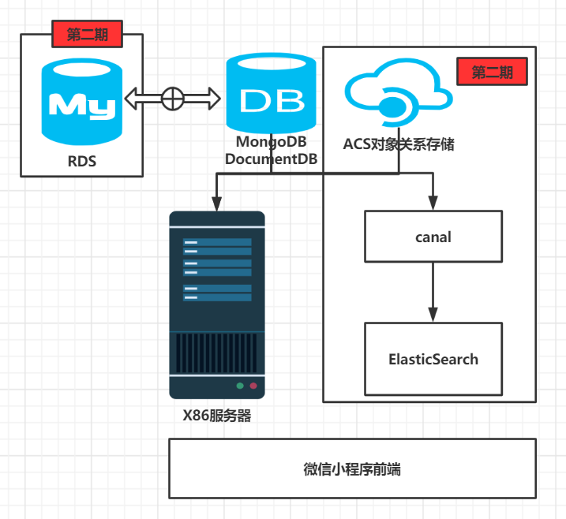

# ZRFintech
投融小管家后台管理系统详细设计文档

### 系统架构
    系统架构如下图所示，为了保证前期MVP开发，后端所有云资源均采取最简化配置（单机），由于数据关系相对简单
    且不存在较多关联查询，为快速部署和易于拓展，项目初期采用非关系型数据库。前期由于不存在搜索功能，所以canal和ES的
    资源也暂时不部署。对于图片、BP书由于前期数量不大，暂且均存在后端服务器上，后续搬上ACS对象存储服务器。
    后续业务流程复杂以后，考虑引入RDS如Mysql。


### 主要对象实体

#### 管理员用户信息
初始化导入

|字段名称|字段释译|字段类型|备注|
|:----:|:----:|:---:|:---:|
|userId|用户Id|String|拟采用自增id|
|userName|用户名称|String||
|phoneNm|手机号码|String|白名单初始化|
|password|登录密码|String||

#### 投资人基础信息(修改)

新增字段：

|字段名称|字段释译|字段类型|备注|
|:----:|:----:|:---:|:---:|
|status|投资人状态|Integer|0-启用用，1-禁用|


### 功能点列表
|功能点|负责人|排期|后端计划完成时间|前后端联调完成时间|
|:----:|:----:|:---:|:---:|:---:|
|管理员登录|唐培轩 |2|||
|管理员首页|唐培轩 |2|||
|查询企业用户列表|唐培轩 |2|||
|查询投资人列表|罗哲明 |2|||
|查询投资人详情|罗哲明 |2|||
|新增投资人|罗哲明|2|||
|修改投资人|罗哲明|2|||
|禁用/启用投资人|唐培轩 |2|||
|查询项目列表|唐培轩 |2|||
|查询项目详情|唐培轩 |2|||
|查询项目评论列表|唐培轩 |2|||
|提交项目评论|唐培轩 |2|||

#### 管理员登陆
- 功能描述

    管理员输入手机号码、登录密码，后端校验成功后跳转到管理员首页。
   
- 请求url

    1. mock链接:
    
    2. dev链接: ip:port/user/login

- 请求数据(POST)
```json
{
    "phoneNm":"",
    "password":""
}
```

- 返回数据
```json
{
  "data": {
     "userId": ""
  },
  "code":"",
  "message":""
}
```    

#### 管理员首页信息展示
- 功能描述

    登录成功，进入首页，展示注册用户数、BP上传数、付费用户数信息。
   
- 请求url

    1. mock链接:
    
    2. dev链接: ip:port/user/homePage

- 请求数据(GET)
```json
{
  "userId" : ""
}
```

- 返回数据
```json
{
  "data": {
     "entUserCount": 0,
     "bpCount": 0,
     "isPayCount": 0
  },
  "code":"",
  "message":""
}
```    

#### 查询企业用户列表
- 功能描述

    分页查询企业注册用户的项目相关信息列表。
   
- 请求url

    1. mock链接:
    
    2. dev链接: ip:port/entUser/pageList

- 请求数据(GET)
```json
{
    "pageNum":"",
    "pageSize":""
}
```

- 返回数据
```json
{
  "data": [
    {
        "phoneNm" : "",
        "nickName" : "",
        "gender" : "",
        "city" : "",
        "province" : "",
        "country" : "",
        "orderCount" : 0,
        "paymentCount" : 0.00
      }
],  
  "code":"",
  "message":""
}
```    

#### 投资人管理模块
- 功能描述及逻辑
    
    针对投资人的信息进行管理、含分页查询、查询详情、新增、修改、启用/禁用功能。
    
1. 查询投资人列表

    分页查询投资人信息列表。

    - 请求url

        1. mock链接:
    
        2. dev链接: ip:port/investor/pageList
    
    - 请求数据（Get）
```json
{
  "pageNum":"",
  "pageSize":""
}
```

- 返回数据
```json
{
	"data":[
		{
			"investor":"",
			"photo":"",
			"orgNm":"",
			"phoneNm":"",
			"stars":""
		}
	],  
   "code":"",
   "message":""
}
```
    
2. 查询投资人详情

    分页查询投资人信息列表。

    - 请求url

        1. mock链接:
    
        2. dev链接: ip:port/investor/detail
    
    - 请求数据（Get）
```json
{
  "investorId":""
}
```

- 返回数据
```json
{
	"data":
    {
        "investorId":"",
        "investor":"",
        "photo":"",
        "businessCard":"",
        "orgNm":"",
        "phoneNm":"",
        "invesEmail":"",
        "price":"",
        "disCountPrice":"",
        "unaccomplishedCount":"",
        "accomplishedCount":"",
        "unaccomplishedAmount":"",
        "indusLabList":"",
        "introd":"",
        "focusFiled":"",
        "finRound":"",
        "stars":""
    },
   "code":"",
   "message":""
}
```
    
3. 新增投资人

    输入投资人相关信息、保存到数据库。(补充：此处可以上传投资人照片信息)

    - 请求url

        1. mock链接:
    
        2. dev链接: ip:port/investor/add
    
    - 请求数据（POST）
```json
{
    "investor":"",
    "orgNm":"",
    "phoneNm":"",
    "invesEmail":"",
    "price":"",
    "disCountPrice":"",
    "indusLabList":"",
    "introd":"",
    "focusFiled":"",
    "finRound":""
}
```

- 返回数据
```json
{
	"data":{
        "investorId": ""
    },  
   "code":"",
   "message":"" 
}
```
    
4.修改投资人

    点击投资人详情，修改相关信息。

    - 请求url

        1. mock链接:
    
        2. dev链接: ip:port/investor/edit
    
    - 请求数据（POST）
```json
{
    "investorId": "",
    "investor":"",
    "orgNm":"",
    "phoneNm":"",
    "invesEmail":"",
    "price":"",
    "disCountPrice":"",
    "indusLabList":"",
    "introd":"",
    "focusFiled":"",
    "finRound":""
}
```

- 返回数据
```json
{
   "code":"",
   "message":"" 
}
```
    
5.启用/禁用投资人

    选中投资人，启用/禁用投资人，被禁用的投资人将无法在融资对接的投资人列表展示。

    - 请求url

        1. mock链接:
    
        2. dev链接: ip:port/investor/status
    
    - 请求数据（POST）
```json
{
    "investorId": "",
    "status":""
}
```

- 返回数据
```json
{
   "code":"",
   "message":"" 
}
```

#### 项目管理模块
- 功能描述及逻辑
    
    针对项目的信息进行管理、含分页查询、查询详情功能。
    
1.查询项目列表

    分页查询项目信息列表。

    - 请求url

        1. mock链接:
    
        2. dev链接: ip:port/project/pageList
    
    - 请求数据（GET）
```json
{
  "pageNum":"",
  "pageSize":""
}
```

- 返回数据
```json
{
	"data":[
		{
			"projectNo":"",
			"projectNm":"",
			"finRound":"",
			"quota":"",
			"teamSize":"",
			"finSt":"",
			"entProvince":"",
			"entCity":"",
			"proDes":"",
			"bpRoute":"",
			"proUser":"",
			"proPhonum":""
		}
	],  
   "code":"",
   "message":""
}
```
    
2.查询项目详情

    查询项目详细信息以及项目评论相关信息列表。

    - 请求url

        1. mock链接:
    
        2. dev链接: ip:port/project/detail
    
    - 请求数据（GET）
```json
{
  "projectNo":""
}
```

- 返回数据
```json
{
	"data":
    {
        "projectNo":"",
        "projectNm":"",
        "finRound":"",
        "quota":"",
        "teamSize":"",
        "finSt":"",
        "entProvince":"",
        "entCity":"",
        "proDes":"",
        "bpRoute":"",
        "proUser":"",
        "proPhonum":"",
        "projectCommentList": [{
          "investor": "",
          "discountPrice": "",
          "isDone": "",
          "favor": ""
      }]
    },  
   "code":"",
   "message":""
}
```

#### 项目评论模块
- 功能描述及逻辑
    
    针对项目评论的信息进行管理、含分页查询、查询详情(详细信息数据从列表选中行带入页面)、提交评论功能。
    
1.查询项目评论列表

    分页查询项目信息列表。

    - 请求url

        1. mock链接:
    
        2. dev链接: ip:port/projectComment/pageList
    
    - 请求数据（GET）
```json
{
  "pageNum":"",
  "pageSize":""
}
```

- 返回数据
```json
{
	"data":[
		{
			"id":"",
			"investorId":"",
			"investor":"",
			"invesPhotoRoute":"",
			"photo":"",
			"projectNo":"",
			"projectNm":"",
			"entCity":"",
			"openId":"",
			"favor":"",
			"content":"",
			"updateTm":"",
			"isDone":"",
			"stars":"",
			"reply":"",
			"replyTm":"",
			"commentAmount":""
		}
	],  
   "code":"",
   "message":""
}
```

2.提交评论

    分页查询项目信息列表。

    - 请求url

        1. mock链接:
    
        2. dev链接: ip:port/projectComment/commit
    
    - 请求数据（POST）
```json
{   "id":"",
    "favor":"",
    "content":"",
    "stars":"",
    "reply":""
}
```

- 返回数据
```json
{
   "code":"",
   "message":""
}
```

##测试方案

